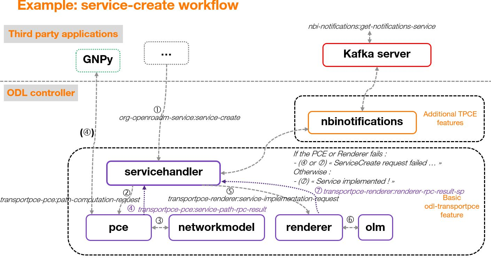

.. _transportpce-dev-guide:

TransportPCE Developer Guide
============================

Overview
--------

TransportPCE describes an application running on top of the OpenDaylight
controller. Its primary function is to control an optical transport
infrastructure using a non-proprietary South Bound Interface (SBI). It may be
interconnected with Controllers of different layers (L2, L3 Controller…), a
higher layer Controller and/or an Orchestrator through non-proprietary
Application Programing Interfaces (APIs). Control includes the capability to
configure the optical equipment, and to provision services according to a
request coming from a higher layer controller and/or an orchestrator.
This capability may rely on the controller only or it may be delegated to
distributed (standardized) protocols.

Architecture
------------

TransportPCE modular architecture is described on the next diagram. Each main
function such as Topology management, Path Calculation Engine (PCE), Service
handler, Renderer \_responsible for the path configuration through optical
equipment\_ and Optical Line Management (OLM) is associated with a generic block
relying on open models, each of them communicating through published APIs.

.. figure:: ./images/TransportPCE-Diagram-Phosphorus.jpg
   :alt: TransportPCE architecture

   TransportPCE architecture

Fluorine, Neon and Sodium releases of transportPCE are dedicated to the control
of WDM transport infrastructure. The WDM layer is built from colorless ROADMs
and transponders.

The interest of using a controller to provision automatically services strongly
relies on its ability to handle end to end optical services that span through
the different network domains, potentially equipped with equipment coming from
different suppliers. Thus, interoperability in the optical layer is a key
element to get the benefit of automated control.

Initial design of TransportPCE leverages OpenROADM Multi-Source-Agreement (MSA)
which defines interoperability specifications, consisting of both Optical
interoperability and Yang data models.

End to end OTN services such as OCH-OTU4, structured ODU4 or 10GE-ODU2e
services are supported since Magnesium SR2. OTN support continued to be
improved in the following releases of Magnesium and Aluminium.

Flexgrid was introduced in Aluminium. Depending on OpenROADM device models,
optical interfaces can be created according to the initial fixed grid (for
R1.2.1, 96 channels regularly spaced of 50 GHz), or to a flexgrid (for R2.2.1
use of specific number of subsequent frequency slots of 6.25 GHz depending on
one side of ROADMs and transponders capabilities and on the other side of the
rate of the channel.

Leveraging Flexgrid feature, high rate services are supported since Silicon.
First implementation allows rendering 400 GE services. This release also brings
asynchronous service creation and deletion, thanks to northbound notifications
modules based on a Kafka implementation, allowing interactions with the DMaaP
Bus of ONAP.

Phosphorus consolidates end to end support for high rate services (ODUC4, OTUC4),
allowing service creation and deletion from the NBI. The support of path
computation for high rate services (OTUC4) will be added through the different P
releases, relying on GNPy for impairment aware path computation. An experimental
support of T-API is provided allowing service-create/delete from a T-API version
2.1.1 compliant NBI. A T-API network topology, with different levels of abstraction
and service context are maintained in the MDSAL. Service state is managed,
monitoring device port state changes. Associated notifications are handled through
Kafka and  DMaaP clients.

Module description
~~~~~~~~~~~~~~~~~~

ServiceHandler
^^^^^^^^^^^^^^

Service Handler handles request coming from a higher level controller or an
orchestrator through the northbound API, as defined in the Open ROADM service model.
Current implementation addresses the following rpcs: service-create, temp-service-
create, service–delete, temp-service-delete, service-reroute, and service-restoration.
It checks the request consistency and trigs path calculation sending rpcs to the PCE.
If a valid path is returned by the PCE, path configuration is initiated relying on
Renderer and OLM. At the confirmation of a successful service creation, the Service
Handler updates the service-list/temp-service-list in the MD-SAL. For service deletion,
the Service Handler relies on the Renderer and the OLM to delete connections and reset
power levels associated with the service. The service-list is updated following a
successful service deletion. In Neon SR0 is added the support for service from ROADM
to ROADM, which brings additional flexibility and notably allows reserving resources
when transponders are not in place at day one. Magnesium SR2 fully supports end-to-end
OTN services which are part of the OTN infrastructure. It concerns the management of
OCH-OTU4 (also part of the optical infrastructure) and structured HO-ODU4 services.
Moreover, once these two kinds of OTN infrastructure service created, it is possible
to manage some LO-ODU services (1GE-ODU0, 10GE-ODU2e). 100GE services are also
supported over ODU4 in transponders or switchponders using higher rate network
interfaces.

In Silicon release, the management of TopologyUpdateNotification coming from the *Topology Management*
module was implemented. This functionality enables the controller to update the information of existing
services according to the online status of the network infrastructure. If any service is affected by
the topology update and the *odl-transportpce-nbi* feature is installed, the Service Handler will send a
notification to a Kafka server with the service update information.

PCE
^^^

The Path Computation Element (PCE) is the component responsible for path
calculation. An interface allows the Service Handler or external components such as an
orchestrator to request a path computation and get a response from the PCE
including the computed path(s) in case of success, or errors and indication of
the reason for the failure in case the request cannot be satisfied. Additional
parameters can be provided by the PCE in addition to the computed paths if
requested by the client module. An interface to the Topology Management module
allows keeping PCE aligned with the latest changes in the topology. Information
about current and planned services is available in the MD-SAL data store.

Current implementation of PCE allows finding the shortest path, minimizing either the hop
count (default) or the propagation delay. Central wavelength is assigned considering a fixed
grid of 96 wavelengths 50 GHz spaced. The assignment of wavelengths according to a flexible
grid considering 768 subsequent slots of 6,25 GHz (total spectrum of 4.8 Thz), and their
occupation by existing services is planned for later releases.
In Neon SR0, the PCE calculates the OSNR, on the base of incremental noise specifications
provided in Open ROADM MSA. The support of unidirectional ports is also added.

PCE handles the following constraints as hard constraints:

-   **Node exclusion**
-   **SRLG exclusion**
-   **Maximum latency**

In Magnesium SR0, the interconnection of the PCE with GNPY (Gaussian Noise Python), an
open-source library developed in the scope of the Telecom Infra Project for building route
planning and optimizing performance in optical mesh networks, is fully supported. Impairment
aware path computation for service of higher rates (Beyond 100G) is planned across Phoshorus
releases. It implies to make B100G OpenROADM specifications available in GNPy libraries.

If the OSNR calculated by the PCE is too close to the limit defined in OpenROADM
specifications, the PCE forwards through a REST interface to GNPY external tool the topology
and the pre-computed path translated in routing constraints. GNPy calculates a set of Quality of
Transmission metrics for this path using its own library which includes models for OpenROADM.
The result is sent back to the PCE. If the path is validated, the PCE sends back a response to
the service handler. In case of invalidation of the path by GNPY, the PCE sends a new request to
GNPY, including only the constraints expressed in the path-computation-request initiated by the
Service Handler. GNPy then tries to calculate a path based on these relaxed constraints. The
result of the path computation is provided to the PCE which translates the path according to the
topology handled in transportPCE and forwards the results to the Service Handler.

GNPy relies on SNR and takes into account the linear and non-linear impairments
to check feasibility. In the related tests, GNPy module runs externally in a
docker and the communication with T-PCE is ensured via HTTPs.

Topology Management
^^^^^^^^^^^^^^^^^^^

Topology management module builds the Topology according to the Network model
defined in OpenROADM. The topology is aligned with IETF I2RS RFC8345 model.
It includes several network layers:

-  **CLLI layer corresponds to the locations that host equipment**
-  **Network layer corresponds to a first level of disaggregation where we
   separate Xponders (transponder, muxponders or switchponders) from ROADMs**
-  **Topology layer introduces a second level of disaggregation where ROADMs
   Add/Drop modules ("SRGs") are separated from the degrees which includes line
   amplifiers and WSS that switch wavelengths from one to another degree**
-  **OTN layer introduced in Magnesium includes transponders as well as switch-ponders and
   mux-ponders having the ability to switch OTN containers from client to line cards. Mg SR0
   release includes creation of the switching pool (used to model cross-connect matrices),
   tributary-ports and tributary-slots at the initial connection of NETCONF devices.
   The population of OTN links (OTU4 and ODU4), and the adjustment of the tributary ports/slots
   pool occupancy when OTN services are created is supported since Magnesium SR2.**

Since Silicon release, the Topology Management module process NETCONF event received through an
event stream (as defined in RFC 5277) between devices and the NETCONF adapter of the controller.
Current implementation detects device configuration changes and updates the topology datastore accordingly.
Then, it sends a TopologyUpdateNotification to the *Service Handler* to indicate that a change has been
detected in the network that may affect some of the already existing services.

Renderer
^^^^^^^^

The Renderer module, on request coming from the Service Handler through a service-
implementation-request /service delete rpc, sets/deletes the path corresponding to a specific
service between A and Z ends. The path description provided by the service-handler to the
renderer is based on abstracted resources (nodes, links and termination-points), as provided
by the PCE module. The renderer converts this path-description in a path topology based on
device resources (circuit-packs, ports,…).

The conversion from abstracted resources to device resources is performed relying on the
portmapping module which maintains the connections between these different resource types.
Portmapping module also allows to keep the topology independant from the devices releases.
In Neon (SR0), portmapping module has been enriched to support both openroadm 1.2.1 and 2.2.1
device models. The full support of openroadm 2.2.1 device models (both in the topology management
and the rendering function) has been added in Neon SR1. In Magnesium, portmapping is enriched with
the supported-interface-capability, OTN supporting-interfaces, and switching-pools (reflecting
cross-connection capabilities of OTN switch-ponders). The support for 7.1 devices models is
introduced in Silicon (no devices of intermediate releases have been proposed and made available
to the market by equipment manufacturers).

After the path is provided, the renderer first checks what are the existing interfaces on the
ports of the different nodes that the path crosses. It then creates missing interfaces. After all
needed interfaces have been created it sets the connections required in the nodes and
notifies the Service Handler on the status of the path creation. Path is created in 2 steps
(from A to Z and Z to A). In case the path between A and Z could not be fully created, a
rollback function is called to set the equipment on the path back to their initial configuration
(as they were before invoking the Renderer).

Magnesium brings the support of OTN services. SR0 supports the creation of OTU4, ODU4, ODU2/ODU2e
and ODU0 interfaces. The creation of these low-order otn interfaces must be triggered through
otn-service-path RPC. Magnesium SR2 fully supports end-to-end otn service implementation into devices
(service-implementation-request /service delete rpc, topology alignement after the service
has been created).

In Silicon releases, higher rate OTN interfaces (OTUC4) must be triggered through otn-service-
path RPC. Phosphorus SR0 supports end-to-end otn service implementation into devices
(service-implementation-request /service delete rpc, topology alignement after the service
has been created). One shall note that impairment aware path calculation for higher rates will
be made available across the Phosphorus release train.

OLM
^^^

Optical Line Management module implements two main features: it is responsible
for setting up the optical power levels on the different interfaces, and is in
charge of adjusting these settings across the life of the optical
infrastructure.

After the different connections have been established in the ROADMS, between 2
Degrees for an express path, or between a SRG and a Degree for an Add or Drop
path; meaning the devices have set WSS and all other required elements to
provide path continuity, power setting are provided as attributes of these
connections. This allows the device to set all complementary elements such as
VOAs, to guaranty that the signal is launched at a correct power level
(in accordance to the specifications) in the fiber span. This also applies
to X-Ponders, as their output power must comply with the specifications defined
for the Add/Drop ports (SRG) of the ROADM. OLM has the responsibility of
calculating the right power settings, sending it to the device, and check the
PM retrieved from the device to verify that the setting was correctly applied
and the configuration was successfully completed.

Inventory
^^^^^^^^^

TransportPCE Inventory module is responsible to keep track of devices connected in an external
MariaDB database. Other databases may be used as long as they comply with SQL and are compatible
with OpenDaylight (for example MySQL). At present, the module supports extracting and persisting
inventory of devices OpenROADM MSA version 1.2.1. Inventory module changes to support newer device
models (2.2.1, etc) and other models (network, service, etc) will be progressively included.

The inventory module can be activated by the associated karaf feature (odl-transporpce-inventory)
The database properties are supplied in the “opendaylight-release” and “opendaylight-snapshots”
profiles. Below is the settings.xml with properties included in the distribution.
The module can be rebuild from sources with different parameters.

Sample entry in settings.xml to declare an external inventory database:
::

    <profiles>
      <profile>
          <id>opendaylight-release</id>
    [..]
         <properties>
                 <transportpce.db.host><<hostname>>:3306</transportpce.db.host>
                 <transportpce.db.database><<databasename>></transportpce.db.database>
                 <transportpce.db.username><<username>></transportpce.db.username>
                 <transportpce.db.password><<password>></transportpce.db.password>
                 <karaf.localFeature>odl-transportpce-inventory</karaf.localFeature>
         </properties>
    </profile>
    [..]
    <profile>
          <id>opendaylight-snapshots</id>
    [..]
         <properties>
                 <transportpce.db.host><<hostname>>:3306</transportpce.db.host>
                 <transportpce.db.database><<databasename>></transportpce.db.database>
                 <transportpce.db.username><<username>></transportpce.db.username>
                 <transportpce.db.password><<password>></transportpce.db.password>
                 <karaf.localFeature>odl-transportpce-inventory</karaf.localFeature>
         </properties>
        </profile>
    </profiles>

Once the project built and when karaf is started, the cfg file is generated in etc folder with the
corresponding properties supplied in settings.xml. When devices with OpenROADM 1.2.1 device model
are mounted, the device listener in the inventory module loads several device attributes to various
tables as per the supplied database. The database structure details can be retrieved from the file
tests/inventory/initdb.sql inside project sources. Installation scripts and a docker file are also
provided.

Key APIs and Interfaces
-----------------------

External API
~~~~~~~~~~~~

North API, interconnecting the Service Handler to higher level applications
relies on the Service Model defined in the MSA. The Renderer and the OLM are
developed to allow configuring Open ROADM devices through a southbound
Netconf/Yang interface and rely on the MSA’s device model.

ServiceHandler Service
^^^^^^^^^^^^^^^^^^^^^^

-  RPC call

   -  service-create (given service-name, service-aend, service-zend)

   -  service-delete (given service-name)

   -  service-reroute (given service-name, service-aend, service-zend)

   -  service-restoration (given service-name, service-aend, service-zend)

   -  temp-service-create (given common-id, service-aend, service-zend)

   -  temp-service-delete (given common-id)

-  Data structure

   -  service list : made of services
   -  temp-service list : made of temporary services
   -  service : composed of service-name, topology wich describes the detailed path (list of used resources)

-  Notification

   - service-rpc-result : result of service RPC
   - service-notification : service has been added, modified or removed

Netconf Service
^^^^^^^^^^^^^^^

-  RPC call

   -  connect-device : PUT
   -  disconnect-device : DELETE
   -  check-connected-device : GET

-  Data Structure

   -  node list : composed of netconf nodes in topology-netconf

Internal APIs
~~~~~~~~~~~~~

Internal APIs define REST APIs to interconnect TransportPCE modules :

-   Service Handler to PCE
-   PCE to Topology Management
-   Service Handler to Renderer
-   Renderer to OLM
-   Network Model to Service Handler

Pce Service
^^^^^^^^^^^

-  RPC call

   -  path-computation-request (given service-name, service-aend, service-zend)

   -  cancel-resource-reserve (given service-name)

-  Notification

   - service-path-rpc-result : result of service RPC

Renderer Service
^^^^^^^^^^^^^^^^

-  RPC call

   -  service-implementation-request (given service-name, service-aend, service-zend)

   -  service-delete (given service-name)

-  Data structure

   -  service path list : composed of service paths
   -  service path : composed of service-name, path description giving the list of abstracted elements (nodes, tps, links)

-  Notification

   - service-path-rpc-result : result of service RPC

Device Renderer
^^^^^^^^^^^^^^^

-  RPC call

   -  service-path used in SR0 as an intermediate solution to address directly the renderer
      from a REST NBI to create OCH-OTU4-ODU4 interfaces on network port of otn devices.

   -  otn-service-path used in SR0 as an intermediate solution to address directly the renderer
      from a REST NBI for otn-service creation. Otn service-creation through
      service-implementation-request call from the Service Handler will be supported in later
      Magnesium releases

Topology Management Service
^^^^^^^^^^^^^^^^^^^^^^^^^^^

-  Data structure

   -  network list : composed of networks(openroadm-topology, netconf-topology)
   -  node list : composed of nodes identified by their node-id
   -  link list : composed of links identified by their link-id
   -  node : composed of roadm, xponder
      link : composed of links of different types (roadm-to-roadm, express, add-drop ...)

OLM Service
^^^^^^^^^^^

-  RPC call

   -  get-pm (given node-id)

   -  service-power-setup

   -  service-power-turndown

   -  service-power-reset

   -  calculate-spanloss-base

   -  calculate-spanloss-current

odl-transportpce-stubmodels
^^^^^^^^^^^^^^^^^^^^^^^^^^^

   -  This feature provides function to be able to stub some of TransportPCE modules, pce and
      renderer (Stubpce and Stubrenderer).
      Stubs are used for development purposes and can be used for some of the functional tests.

Interfaces to external software
~~~~~~~~~~~~~~~~~~~~~~~~~~~~~~~

It defines the interfaces implemented to interconnect TransportPCE modules with other software in
order to perform specific tasks

GNPy interface
^^^^^^^^^^^^^^

-  Request structure

   -  topology : composed of list of elements and connections
   -  service : source, destination, explicit-route-objects, path-constraints

-  Response structure

   -  path-properties/path-metric : OSNR-0.1nm, OSNR-bandwidth, SNR-0.1nm, SNR-bandwidth,
   -  path-properties/path-route-objects : composed of path elements

Running transportPCE project
----------------------------

To use transportPCE controller, the first step is to connect the controller to optical nodes
through the NETCONF connector.

.. note::

    In the current version, only optical equipment compliant with open ROADM datamodels are managed
    by transportPCE.

Connecting nodes
~~~~~~~~~~~~~~~~

To connect a node, use the following RESTconf request

**REST API** : *PUT /rests/data/network-topology:network-topology/topology=topology-netconf/node=<node-id>*

**Sample JSON Data**

.. code:: json

    {
        "node": [
            {
                "node-id": "<node-id>",
                "netconf-node-topology:tcp-only": "false",
                "netconf-node-topology:reconnect-on-changed-schema": "false",
                "netconf-node-topology:host": "<node-ip-address>",
                "netconf-node-topology:default-request-timeout-millis": "120000",
                "netconf-node-topology:max-connection-attempts": "0",
                "netconf-node-topology:sleep-factor": "1.5",
                "netconf-node-topology:actor-response-wait-time": "5",
                "netconf-node-topology:concurrent-rpc-limit": "0",
                "netconf-node-topology:between-attempts-timeout-millis": "2000",
                "netconf-node-topology:port": "<netconf-port>",
                "netconf-node-topology:connection-timeout-millis": "20000",
                "netconf-node-topology:username": "<node-username>",
                "netconf-node-topology:password": "<node-password>",
                "netconf-node-topology:keepalive-delay": "300"
            }
        ]
    }

Then check that the netconf session has been correctly established between the controller and the
node. the status of **netconf-node-topology:connection-status** must be **connected**

**REST API** : *GET /rests/data/network-topology:network-topology/topology=topology-netconf/node=<node-id>?content=nonconfig*

Node configuration discovery
~~~~~~~~~~~~~~~~~~~~~~~~~~~~

Once the controller is connected to the node, transportPCE application automatically launchs a
discovery of the node configuration datastore and creates **Logical Connection Points** to any
physical ports related to transmission. All *circuit-packs* inside the node configuration are
analyzed.

Use the following RESTconf URI to check that function internally named *portMapping*.

**REST API** : *GET /rests/data/transportpce-portmapping:network*

.. note::

    In ``org-openroadm-device.yang``, four types of optical nodes can be managed:
        * rdm: ROADM device (optical switch)
        * xpdr: Xponder device (device that converts client to optical channel interface)
        * ila: in line amplifier (optical amplifier)
        * extplug: external pluggable (an optical pluggable that can be inserted in an external unit such as a router)

    TransportPCE currently supports rdm and xpdr

Depending on the kind of open ROADM device connected, different kind of *Logical Connection Points*
should appear, if the node configuration is not empty:

-  DEG<degree-number>-TTP-<port-direction>: created on the line port of a degree on a rdm equipment
-  SRG<srg-number>-PP<port-number>: created on the client port of a srg on a rdm equipment
-  XPDR<number>-CLIENT<port-number>: created on the client port of a xpdr equipment
-  XPDR<number>-NETWORK<port-number>: created on the line port of a xpdr equipment

    For further details on openROADM device models, see `openROADM MSA white paper <https://0201.nccdn.net/1_2/000/000/134/c50/Open-ROADM-MSA-release-2-Device-White-paper-v1-1.pdf>`__.

Optical Network topology
~~~~~~~~~~~~~~~~~~~~~~~~

Before creating an optical connectivity service, your topology must contain at least two xpdr
devices connected to two different rdm devices. Normally, the *openroadm-topology* is automatically
created by transportPCE. Nevertheless, depending on the configuration inside optical nodes, this
topology can be partial. Check that link of type *ROADMtoROADM* exists between two adjacent rdm
nodes.

**REST API** : *GET /rests/data/ietf-network:networks/network=openroadm-topology*

If it is not the case, you need to manually complement the topology with *ROADMtoROADM* link using
the following REST RPC:

**REST API** : *POST /rests/operations/transportpce-networkutils:init-roadm-nodes*

**Sample JSON Data**

.. code:: json

    {
      "input": {
        "rdm-a-node": "<node-id-A>",
        "deg-a-num": "<degree-A-number>",
        "termination-point-a": "<Logical-Connection-Point>",
        "rdm-z-node": "<node-id-Z>",
        "deg-z-num": "<degree-Z-number>",
        "termination-point-z": "<Logical-Connection-Point>"
      }
    }

*<Logical-Connection-Point> comes from the portMapping function*.

Unidirectional links between xpdr and rdm nodes must be created manually. To that end use the two
following REST RPCs:

From xpdr to rdm:
^^^^^^^^^^^^^^^^^

**REST API** : *POST /rests/operations/transportpce-networkutils:init-xpdr-rdm-links*

**Sample JSON Data**

.. code:: json

    {
      "input": {
        "links-input": {
          "xpdr-node": "<xpdr-node-id>",
          "xpdr-num": "1",
          "network-num": "<xpdr-network-port-number>",
          "rdm-node": "<rdm-node-id>",
          "srg-num": "<srg-number>",
          "termination-point-num": "<Logical-Connection-Point>"
        }
      }
    }

From rdm to xpdr:
^^^^^^^^^^^^^^^^^

**REST API** : *POST /rests/operations/transportpce-networkutils:init-rdm-xpdr-links*

**Sample JSON Data**

.. code:: json

    {
      "input": {
        "links-input": {
          "xpdr-node": "<xpdr-node-id>",
          "xpdr-num": "1",
          "network-num": "<xpdr-network-port-number>",
          "rdm-node": "<rdm-node-id>",
          "srg-num": "<srg-number>",
          "termination-point-num": "<Logical-Connection-Point>"
        }
      }
    }

OTN topology
~~~~~~~~~~~~

Before creating an OTN service, your topology must contain at least two xpdr devices of MUXPDR
or SWITCH type connected to two different rdm devices. To check that these xpdr are present in the
OTN topology, use the following command on the REST API :

**REST API** : *GET /rests/data/ietf-network:networks/network=otn-topology*

An optical connectivity service shall have been created in a first setp. Since Magnesium SR2, the OTN
links are automatically populated in the topology after the Och, OTU4 and ODU4 interfaces have
been created on the two network ports of the xpdr.

Creating a service
~~~~~~~~~~~~~~~~~~

Use the *service handler* module to create any end-to-end connectivity service on an OpenROADM
network. Two different kinds of end-to-end "optical" services are managed by TransportPCE:
- 100GE/400GE services from client port to client port of two transponders (TPDR)
- Optical Channel (OC) service from client add/drop port (PP port of SRG) to client add/drop port of
two ROADMs.

For these services, TransportPCE automatically invokes *renderer* module to create all required
interfaces and cross-connection on each device supporting the service.
As an example, the creation of a 100GE service implies among other things, the creation of OCH or
Optical Tributary Signal (OTSi), OTU4 and ODU4 interfaces on the Network port of TPDR devices.
The creation of a 400GE service implies the creation of OTSi, OTUC4, ODUC4 and ODU4 interfaces on
the Network port of TPDR devices.

Since Magnesium SR2, the *service handler* module directly manages some end-to-end otn
connectivity services.
Before creating a low-order OTN service (1GE or 10GE services terminating on client port of MUXPDR
or SWITCH), the user must ensure that a high-order ODU4 container exists and has previously been
configured (it means structured to support low-order otn services) to support low-order OTN containers.
Thus, OTN service creation implies three steps:
1. OCH-OTU4 service from network port to network port of two OTN Xponders (MUXPDR or SWITCH)
2. HO-ODU4 service from network port to network port of two OTN Xponders (MUXPDR or SWITCH)
3. 10GE service creation from client port to client port of two OTN Xponders (MUXPDR or SWITCH)

The management of other OTN services (1GE-ODU0, 100GE...) is planned for future releases.

100GE service creation
^^^^^^^^^^^^^^^^^^^^^^

Use the following REST RPC to invoke *service handler* module in order to create a bidirectional
end-to-end optical connectivity service between two xpdr over an optical network composed of rdm
nodes.

**REST API** : *POST /restconf/operations/org-openroadm-service:service-create*

**Sample JSON Data**

.. code:: json

    {
        "input": {
            "sdnc-request-header": {
                "request-id": "request-1",
                "rpc-action": "service-create",
                "request-system-id": "appname"
            },
            "service-name": "test1",
            "common-id": "commonId",
            "connection-type": "service",
            "service-a-end": {
                "service-rate": "100",
                "node-id": "<xpdr-node-id>",
                "service-format": "Ethernet",
                "clli": "<ccli-name>",
                "tx-direction": {
                    "port": {
                        "port-device-name": "<xpdr-client-port>",
                        "port-type": "fixed",
                        "port-name": "<xpdr-client-port-number>",
                        "port-rack": "000000.00",
                        "port-shelf": "Chassis#1"
                    },
                    "lgx": {
                        "lgx-device-name": "Some lgx-device-name",
                        "lgx-port-name": "Some lgx-port-name",
                        "lgx-port-rack": "000000.00",
                        "lgx-port-shelf": "00"
                    }
                },
                "rx-direction": {
                    "port": {
                        "port-device-name": "<xpdr-client-port>",
                        "port-type": "fixed",
                        "port-name": "<xpdr-client-port-number>",
                        "port-rack": "000000.00",
                        "port-shelf": "Chassis#1"
                    },
                    "lgx": {
                        "lgx-device-name": "Some lgx-device-name",
                        "lgx-port-name": "Some lgx-port-name",
                        "lgx-port-rack": "000000.00",
                        "lgx-port-shelf": "00"
                    }
                },
                "optic-type": "gray"
            },
            "service-z-end": {
                "service-rate": "100",
                "node-id": "<xpdr-node-id>",
                "service-format": "Ethernet",
                "clli": "<ccli-name>",
                "tx-direction": {
                    "port": {
                        "port-device-name": "<xpdr-client-port>",
                        "port-type": "fixed",
                        "port-name": "<xpdr-client-port-number>",
                        "port-rack": "000000.00",
                        "port-shelf": "Chassis#1"
                    },
                    "lgx": {
                        "lgx-device-name": "Some lgx-device-name",
                        "lgx-port-name": "Some lgx-port-name",
                        "lgx-port-rack": "000000.00",
                        "lgx-port-shelf": "00"
                    }
                },
                "rx-direction": {
                    "port": {
                        "port-device-name": "<xpdr-client-port>",
                        "port-type": "fixed",
                        "port-name": "<xpdr-client-port-number>",
                        "port-rack": "000000.00",
                        "port-shelf": "Chassis#1"
                    },
                    "lgx": {
                        "lgx-device-name": "Some lgx-device-name",
                        "lgx-port-name": "Some lgx-port-name",
                        "lgx-port-rack": "000000.00",
                        "lgx-port-shelf": "00"
                    }
                },
                "optic-type": "gray"
            },
            "due-date": "yyyy-mm-ddT00:00:01Z",
            "operator-contact": "some-contact-info"
        }
    }

Most important parameters for this REST RPC are the identification of the two physical client ports
on xpdr nodes.This RPC invokes the *PCE* module to compute a path over the *openroadm-topology* and
then invokes *renderer* and *OLM* to implement the end-to-end path into the devices.

OC service creation
^^^^^^^^^^^^^^^^^^^

Use the following REST RPC to invoke *service handler* module in order to create a bidirectional
end-to end Optical Channel (OC) connectivity service between two add/drop ports (PP port of SRG
node) over an optical network only composed of rdm nodes.

**REST API** : *POST /restconf/operations/org-openroadm-service:service-create*

**Sample JSON Data**

.. code:: json

    {
        "input": {
            "sdnc-request-header": {
                "request-id": "request-1",
                "rpc-action": "service-create",
                "request-system-id": "appname"
            },
            "service-name": "something",
            "common-id": "commonId",
            "connection-type": "roadm-line",
            "service-a-end": {
                "service-rate": "100",
                "node-id": "<xpdr-node-id>",
                "service-format": "OC",
                "clli": "<ccli-name>",
                "tx-direction": {
                    "port": {
                        "port-device-name": "<xpdr-client-port>",
                        "port-type": "fixed",
                        "port-name": "<xpdr-client-port-number>",
                        "port-rack": "000000.00",
                        "port-shelf": "Chassis#1"
                    },
                    "lgx": {
                        "lgx-device-name": "Some lgx-device-name",
                        "lgx-port-name": "Some lgx-port-name",
                        "lgx-port-rack": "000000.00",
                        "lgx-port-shelf": "00"
                    }
                },
                "rx-direction": {
                    "port": {
                        "port-device-name": "<xpdr-client-port>",
                        "port-type": "fixed",
                        "port-name": "<xpdr-client-port-number>",
                        "port-rack": "000000.00",
                        "port-shelf": "Chassis#1"
                    },
                    "lgx": {
                        "lgx-device-name": "Some lgx-device-name",
                        "lgx-port-name": "Some lgx-port-name",
                        "lgx-port-rack": "000000.00",
                        "lgx-port-shelf": "00"
                    }
                },
                "optic-type": "gray"
            },
            "service-z-end": {
                "service-rate": "100",
                "node-id": "<xpdr-node-id>",
                "service-format": "OC",
                "clli": "<ccli-name>",
                "tx-direction": {
                    "port": {
                        "port-device-name": "<xpdr-client-port>",
                        "port-type": "fixed",
                        "port-name": "<xpdr-client-port-number>",
                        "port-rack": "000000.00",
                        "port-shelf": "Chassis#1"
                    },
                    "lgx": {
                        "lgx-device-name": "Some lgx-device-name",
                        "lgx-port-name": "Some lgx-port-name",
                        "lgx-port-rack": "000000.00",
                        "lgx-port-shelf": "00"
                    }
                },
                "rx-direction": {
                    "port": {
                        "port-device-name": "<xpdr-client-port>",
                        "port-type": "fixed",
                        "port-name": "<xpdr-client-port-number>",
                        "port-rack": "000000.00",
                        "port-shelf": "Chassis#1"
                    },
                    "lgx": {
                        "lgx-device-name": "Some lgx-device-name",
                        "lgx-port-name": "Some lgx-port-name",
                        "lgx-port-rack": "000000.00",
                        "lgx-port-shelf": "00"
                    }
                },
                "optic-type": "gray"
            },
            "due-date": "yyyy-mm-ddT00:00:01Z",
            "operator-contact": "some-contact-info"
        }
    }

As for the previous RPC, this RPC invokes the *PCE* module to compute a path over the
*openroadm-topology* and then invokes *renderer* and *OLM* to implement the end-to-end path into
the devices.

OTN OCH-OTU4 service creation
^^^^^^^^^^^^^^^^^^^^^^^^^^^^^

Use the following REST RPC to invoke *service handler* module in order to create over the optical
infrastructure a bidirectional end-to-end OTU4 over an optical wavelength connectivity service
between two optical network ports of OTN Xponder (MUXPDR or SWITCH). Such service configure the
optical network infrastructure composed of rdm nodes.

**REST API** : *POST /restconf/operations/org-openroadm-service:service-create*

**Sample JSON Data**

.. code:: json

    {
        "input": {
            "sdnc-request-header": {
                "request-id": "request-1",
                "rpc-action": "service-create",
                "request-system-id": "appname"
            },
            "service-name": "something",
            "common-id": "commonId",
            "connection-type": "infrastructure",
            "service-a-end": {
                "service-rate": "100",
                "node-id": "<xpdr-node-id>",
                "service-format": "OTU",
                "otu-service-rate": "org-openroadm-otn-common-types:OTU4",
                "clli": "<ccli-name>",
                "tx-direction": {
                    "port": {
                        "port-device-name": "<xpdr-node-id-in-otn-topology>",
                        "port-type": "fixed",
                        "port-name": "<xpdr-network-port-in-otn-topology>",
                        "port-rack": "000000.00",
                        "port-shelf": "Chassis#1"
                    },
                    "lgx": {
                        "lgx-device-name": "Some lgx-device-name",
                        "lgx-port-name": "Some lgx-port-name",
                        "lgx-port-rack": "000000.00",
                        "lgx-port-shelf": "00"
                    }
                },
                "rx-direction": {
                    "port": {
                        "port-device-name": "<xpdr-node-id-in-otn-topology>",
                        "port-type": "fixed",
                        "port-name": "<xpdr-network-port-in-otn-topology>",
                        "port-rack": "000000.00",
                        "port-shelf": "Chassis#1"
                    },
                    "lgx": {
                        "lgx-device-name": "Some lgx-device-name",
                        "lgx-port-name": "Some lgx-port-name",
                        "lgx-port-rack": "000000.00",
                        "lgx-port-shelf": "00"
                    }
                },
                "optic-type": "gray"
            },
            "service-z-end": {
                "service-rate": "100",
                "node-id": "<xpdr-node-id>",
                "service-format": "OTU",
                "otu-service-rate": "org-openroadm-otn-common-types:OTU4",
                "clli": "<ccli-name>",
                "tx-direction": {
                    "port": {
                        "port-device-name": "<xpdr-node-id-in-otn-topology>",
                        "port-type": "fixed",
                        "port-name": "<xpdr-network-port-in-otn-topology>",
                        "port-rack": "000000.00",
                        "port-shelf": "Chassis#1"
                    },
                    "lgx": {
                        "lgx-device-name": "Some lgx-device-name",
                        "lgx-port-name": "Some lgx-port-name",
                        "lgx-port-rack": "000000.00",
                        "lgx-port-shelf": "00"
                    }
                },
                "rx-direction": {
                    "port": {
                        "port-device-name": "<xpdr-node-id-in-otn-topology>",
                        "port-type": "fixed",
                        "port-name": "<xpdr-network-port-in-otn-topology>",
                        "port-rack": "000000.00",
                        "port-shelf": "Chassis#1"
                    },
                    "lgx": {
                        "lgx-device-name": "Some lgx-device-name",
                        "lgx-port-name": "Some lgx-port-name",
                        "lgx-port-rack": "000000.00",
                        "lgx-port-shelf": "00"
                    }
                },
                "optic-type": "gray"
            },
            "due-date": "yyyy-mm-ddT00:00:01Z",
            "operator-contact": "some-contact-info"
        }
    }

As for the previous RPC, this RPC invokes the *PCE* module to compute a path over the
*openroadm-topology* and then invokes *renderer* and *OLM* to implement the end-to-end path into
the devices.

OTSi-OTUC4 service creation
^^^^^^^^^^^^^^^^^^^^^^^^^^^

Use the following REST RPC to invoke *service handler* module in order to create over the optical
infrastructure a bidirectional end-to-end OTUC4 over an optical Optical Tributary Signal
connectivity service between two optical network ports of OTN Xponder (MUXPDR or SWITCH). Such
service configure the optical network infrastructure composed of rdm nodes.

**REST API** : *POST /restconf/operations/org-openroadm-service:service-create*

**Sample JSON Data**

.. code:: json

    {
        "input": {
            "sdnc-request-header": {
                "request-id": "request-1",
                "rpc-action": "service-create",
                "request-system-id": "appname"
            },
            "service-name": "something",
            "common-id": "commonId",
            "connection-type": "infrastructure",
            "service-a-end": {
                "service-rate": "400",
                "node-id": "<xpdr-node-id>",
                "service-format": "OTU",
                "otu-service-rate": "org-openroadm-otn-common-types:OTUCn",
                "clli": "<ccli-name>",
                "tx-direction": {
                    "port": {
                        "port-device-name": "<xpdr-node-id-in-otn-topology>",
                        "port-type": "fixed",
                        "port-name": "<xpdr-network-port-in-otn-topology>",
                        "port-rack": "000000.00",
                        "port-shelf": "Chassis#1"
                    },
                    "lgx": {
                        "lgx-device-name": "Some lgx-device-name",
                        "lgx-port-name": "Some lgx-port-name",
                        "lgx-port-rack": "000000.00",
                        "lgx-port-shelf": "00"
                    }
                },
                "rx-direction": {
                    "port": {
                        "port-device-name": "<xpdr-node-id-in-otn-topology>",
                        "port-type": "fixed",
                        "port-name": "<xpdr-network-port-in-otn-topology>",
                        "port-rack": "000000.00",
                        "port-shelf": "Chassis#1"
                    },
                    "lgx": {
                        "lgx-device-name": "Some lgx-device-name",
                        "lgx-port-name": "Some lgx-port-name",
                        "lgx-port-rack": "000000.00",
                        "lgx-port-shelf": "00"
                    }
                },
                "optic-type": "gray"
            },
            "service-z-end": {
                "service-rate": "400",
                "node-id": "<xpdr-node-id>",
                "service-format": "OTU",
                "otu-service-rate": "org-openroadm-otn-common-types:OTUCn",
                "clli": "<ccli-name>",
                "tx-direction": {
                    "port": {
                        "port-device-name": "<xpdr-node-id-in-otn-topology>",
                        "port-type": "fixed",
                        "port-name": "<xpdr-network-port-in-otn-topology>",
                        "port-rack": "000000.00",
                        "port-shelf": "Chassis#1"
                    },
                    "lgx": {
                        "lgx-device-name": "Some lgx-device-name",
                        "lgx-port-name": "Some lgx-port-name",
                        "lgx-port-rack": "000000.00",
                        "lgx-port-shelf": "00"
                    }
                },
                "rx-direction": {
                    "port": {
                        "port-device-name": "<xpdr-node-id-in-otn-topology>",
                        "port-type": "fixed",
                        "port-name": "<xpdr-network-port-in-otn-topology>",
                        "port-rack": "000000.00",
                        "port-shelf": "Chassis#1"
                    },
                    "lgx": {
                        "lgx-device-name": "Some lgx-device-name",
                        "lgx-port-name": "Some lgx-port-name",
                        "lgx-port-rack": "000000.00",
                        "lgx-port-shelf": "00"
                    }
                },
                "optic-type": "gray"
            },
            "due-date": "yyyy-mm-ddT00:00:01Z",
            "operator-contact": "some-contact-info"
        }
    }

As for the previous RPC, this RPC invokes the *PCE* module to compute a path over the
*openroadm-topology* and then invokes *renderer* and *OLM* to implement the end-to-end path into
the devices.

One shall note that in Phosphorus SR0, as the OpenROADM 400G specification are not available (neither
in the GNPy libraries, nor in the *PCE* module), path validation will be performed using the same
asumptions as we use for 100G. This means the path may be validated whereas optical performances do
not reach expected levels. This allows testing OpenROADM device implementing B100G rates, but shall
not be used in operational conditions. The support for higher rate impairment aware path computation
will be introduced across Phosphorus release train.

ODUC4 service creation
^^^^^^^^^^^^^^^^^^^^^^

For ODUC4 service creation, the REST RPC to invoke *service handler* module in order to create an
ODUC4 over the OTSi-OTUC4 has the same format as the RPC used for the creation of this last. Only
"service-format" needs to be changed to "ODU", and "otu-service-rate" : "org-openroadm-otn-common-
types:OTUCn" needs to be replaced by: "odu-service-rate" : "org-openroadm-otn-common-types:ODUCn"
in both service-a-end and service-z-end containers.

OTN HO-ODU4 service creation
^^^^^^^^^^^^^^^^^^^^^^^^^^^^

Use the following REST RPC to invoke *service handler* module in order to create over the optical
infrastructure a bidirectional end-to-end ODU4 OTN service over an OTU4 and structured to support
low-order OTN services (ODU2e, ODU0). As for OTU4, such a service must be created between two network
ports of OTN Xponder (MUXPDR or SWITCH).

**REST API** : *POST /restconf/operations/org-openroadm-service:service-create*

**Sample JSON Data**

.. code:: json

    {
        "input": {
            "sdnc-request-header": {
                "request-id": "request-1",
                "rpc-action": "service-create",
                "request-system-id": "appname"
            },
            "service-name": "something",
            "common-id": "commonId",
            "connection-type": "infrastructure",
            "service-a-end": {
                "service-rate": "100",
                "node-id": "<xpdr-node-id>",
                "service-format": "ODU",
                "otu-service-rate": "org-openroadm-otn-common-types:ODU4",
                "clli": "<ccli-name>",
                "tx-direction": {
                    "port": {
                        "port-device-name": "<xpdr-node-id-in-otn-topology>",
                        "port-type": "fixed",
                        "port-name": "<xpdr-network-port-in-otn-topology>",
                        "port-rack": "000000.00",
                        "port-shelf": "Chassis#1"
                    },
                    "lgx": {
                        "lgx-device-name": "Some lgx-device-name",
                        "lgx-port-name": "Some lgx-port-name",
                        "lgx-port-rack": "000000.00",
                        "lgx-port-shelf": "00"
                    }
                },
                "rx-direction": {
                    "port": {
                        "port-device-name": "<xpdr-node-id-in-otn-topology>",
                        "port-type": "fixed",
                        "port-name": "<xpdr-network-port-in-otn-topology>",
                        "port-rack": "000000.00",
                        "port-shelf": "Chassis#1"
                    },
                    "lgx": {
                        "lgx-device-name": "Some lgx-device-name",
                        "lgx-port-name": "Some lgx-port-name",
                        "lgx-port-rack": "000000.00",
                        "lgx-port-shelf": "00"
                    }
                },
                "optic-type": "gray"
            },
            "service-z-end": {
                "service-rate": "100",
                "node-id": "<xpdr-node-id>",
                "service-format": "ODU",
                "otu-service-rate": "org-openroadm-otn-common-types:ODU4",
                "clli": "<ccli-name>",
                "tx-direction": {
                    "port": {
                        "port-device-name": "<xpdr-node-id-in-otn-topology>",
                        "port-type": "fixed",
                        "port-name": "<xpdr-network-port-in-otn-topology>",
                        "port-rack": "000000.00",
                        "port-shelf": "Chassis#1"
                    },
                    "lgx": {
                        "lgx-device-name": "Some lgx-device-name",
                        "lgx-port-name": "Some lgx-port-name",
                        "lgx-port-rack": "000000.00",
                        "lgx-port-shelf": "00"
                    }
                },
                "rx-direction": {
                    "port": {
                        "port-device-name": "<xpdr-node-id-in-otn-topology>",
                        "port-type": "fixed",
                        "port-name": "<xpdr-network-port-in-otn-topology>",
                        "port-rack": "000000.00",
                        "port-shelf": "Chassis#1"
                    },
                    "lgx": {
                        "lgx-device-name": "Some lgx-device-name",
                        "lgx-port-name": "Some lgx-port-name",
                        "lgx-port-rack": "000000.00",
                        "lgx-port-shelf": "00"
                    }
                },
                "optic-type": "gray"
            },
            "due-date": "yyyy-mm-ddT00:00:01Z",
            "operator-contact": "some-contact-info"
        }
    }

As for the previous RPC, this RPC invokes the *PCE* module to compute a path over the
*otn-topology* that must contains OTU4 links with valid bandwidth parameters, and then
invokes *renderer* and *OLM* to implement the end-to-end path into the devices.

OTN 10GE-ODU2e service creation
^^^^^^^^^^^^^^^^^^^^^^^^^^^^^^^

Use the following REST RPC to invoke *service handler* module in order to create over the OTN
infrastructure a bidirectional end-to-end 10GE-ODU2e OTN service over an ODU4.
Such a service must be created between two client ports of OTN Xponder (MUXPDR or SWITCH)
configured to support 10GE interfaces.

**REST API** : *POST /restconf/operations/org-openroadm-service:service-create*

**Sample JSON Data**

.. code:: json

    {
        "input": {
            "sdnc-request-header": {
                "request-id": "request-1",
                "rpc-action": "service-create",
                "request-system-id": "appname"
            },
            "service-name": "something",
            "common-id": "commonId",
            "connection-type": "service",
            "service-a-end": {
                "service-rate": "10",
                "node-id": "<xpdr-node-id>",
                "service-format": "Ethernet",
                "clli": "<ccli-name>",
                "subrate-eth-sla": {
                    "subrate-eth-sla": {
                        "committed-info-rate": "10000",
                        "committed-burst-size": "64"
                    }
                },
                "tx-direction": {
                    "port": {
                        "port-device-name": "<xpdr-node-id-in-otn-topology>",
                        "port-type": "fixed",
                        "port-name": "<xpdr-client-port-in-otn-topology>",
                        "port-rack": "000000.00",
                        "port-shelf": "Chassis#1"
                    },
                    "lgx": {
                        "lgx-device-name": "Some lgx-device-name",
                        "lgx-port-name": "Some lgx-port-name",
                        "lgx-port-rack": "000000.00",
                        "lgx-port-shelf": "00"
                    }
                },
                "rx-direction": {
                    "port": {
                        "port-device-name": "<xpdr-node-id-in-otn-topology>",
                        "port-type": "fixed",
                        "port-name": "<xpdr-client-port-in-otn-topology>",
                        "port-rack": "000000.00",
                        "port-shelf": "Chassis#1"
                    },
                    "lgx": {
                        "lgx-device-name": "Some lgx-device-name",
                        "lgx-port-name": "Some lgx-port-name",
                        "lgx-port-rack": "000000.00",
                        "lgx-port-shelf": "00"
                    }
                },
                "optic-type": "gray"
            },
            "service-z-end": {
                "service-rate": "10",
                "node-id": "<xpdr-node-id>",
                "service-format": "Ethernet",
                "clli": "<ccli-name>",
                "subrate-eth-sla": {
                    "subrate-eth-sla": {
                        "committed-info-rate": "10000",
                        "committed-burst-size": "64"
                    }
                },
                "tx-direction": {
                    "port": {
                        "port-device-name": "<xpdr-node-id-in-otn-topology>",
                        "port-type": "fixed",
                        "port-name": "<xpdr-client-port-in-otn-topology>",
                        "port-rack": "000000.00",
                        "port-shelf": "Chassis#1"
                    },
                    "lgx": {
                        "lgx-device-name": "Some lgx-device-name",
                        "lgx-port-name": "Some lgx-port-name",
                        "lgx-port-rack": "000000.00",
                        "lgx-port-shelf": "00"
                    }
                },
                "rx-direction": {
                    "port": {
                        "port-device-name": "<xpdr-node-id-in-otn-topology>",
                        "port-type": "fixed",
                        "port-name": "<xpdr-client-port-in-otn-topology>",
                        "port-rack": "000000.00",
                        "port-shelf": "Chassis#1"
                    },
                    "lgx": {
                        "lgx-device-name": "Some lgx-device-name",
                        "lgx-port-name": "Some lgx-port-name",
                        "lgx-port-rack": "000000.00",
                        "lgx-port-shelf": "00"
                    }
                },
                "optic-type": "gray"
            },
            "due-date": "yyyy-mm-ddT00:00:01Z",
            "operator-contact": "some-contact-info"
        }
    }

As for the previous RPC, this RPC invokes the *PCE* module to compute a path over the
*otn-topology* that must contains ODU4 links with valid bandwidth parameters, and then
invokes *renderer* and *OLM* to implement the end-to-end path into the devices.

.. note::
    Since Magnesium SR2, the service-list corresponding to OCH-OTU4, ODU4 or again 10GE-ODU2e services is
    updated in the service-list datastore.

.. note::
    trib-slot is used when the equipment supports contiguous trib-slot allocation (supported from
    Magnesium SR0). The trib-slot provided corresponds to the first of the used trib-slots.
    complex-trib-slots will be used when the equipment does not support contiguous trib-slot
    allocation. In this case a list of the different trib-slots to be used shall be provided.
    The support for non contiguous trib-slot allocation is planned for later release.

Deleting a service
~~~~~~~~~~~~~~~~~~

Deleting any kind of service
^^^^^^^^^^^^^^^^^^^^^^^^^^^^

Use the following REST RPC to invoke *service handler* module in order to delete a given optical
connectivity service.

**REST API** : *POST /restconf/operations/org-openroadm-service:service-delete*

**Sample JSON Data**

.. code:: json

    {
        "input": {
            "sdnc-request-header": {
                "request-id": "request-1",
                "rpc-action": "service-delete",
                "request-system-id": "appname",
                "notification-url": "http://localhost:8585/NotificationServer/notify"
            },
            "service-delete-req-info": {
                "service-name": "something",
                "tail-retention": "no"
            }
        }
    }

Most important parameters for this REST RPC is the *service-name*.

.. note::
    Deleting OTN services implies proceeding in the reverse way to their creation. Thus, OTN
    service deletion must respect the three following steps:
    1. delete first all 10GE services supported over any ODU4 to be deleted
    2. delete ODU4
    3. delete OCH-OTU4 supporting the just deleted ODU4

Invoking PCE module
~~~~~~~~~~~~~~~~~~~

Use the following REST RPCs to invoke *PCE* module in order to check connectivity between xponder
nodes and the availability of a supporting optical connectivity between the network-ports of the
nodes.

Checking OTU4 service connectivity
^^^^^^^^^^^^^^^^^^^^^^^^^^^^^^^^^^

**REST API** : *POST /restconf/operations/transportpce-pce:path-computation-request*

**Sample JSON Data**

.. code:: json

   {
      "input": {
           "service-name": "something",
           "resource-reserve": "true",
           "service-handler-header": {
             "request-id": "request1"
           },
           "service-a-end": {
             "service-rate": "100",
             "clli": "<clli-node>",
             "service-format": "OTU",
             "node-id": "<otn-node-id>"
           },
           "service-z-end": {
             "service-rate": "100",
             "clli": "<clli-node>",
             "service-format": "OTU",
             "node-id": "<otn-node-id>"
             },
           "pce-metric": "hop-count"
       }
   }

.. note::
    here, the <otn-node-id> corresponds to the node-id as appearing in "openroadm-network" topology
    layer

Checking ODU4 service connectivity
^^^^^^^^^^^^^^^^^^^^^^^^^^^^^^^^^^

**REST API** : *POST /restconf/operations/transportpce-pce:path-computation-request*

**Sample JSON Data**

.. code:: json

   {
      "input": {
           "service-name": "something",
           "resource-reserve": "true",
           "service-handler-header": {
             "request-id": "request1"
           },
           "service-a-end": {
             "service-rate": "100",
             "clli": "<clli-node>",
             "service-format": "ODU",
             "node-id": "<otn-node-id>"
           },
           "service-z-end": {
             "service-rate": "100",
             "clli": "<clli-node>",
             "service-format": "ODU",
             "node-id": "<otn-node-id>"
             },
           "pce-metric": "hop-count"
       }
   }

.. note::
    here, the <otn-node-id> corresponds to the node-id as appearing in "otn-topology" layer

Checking 10GE/ODU2e service connectivity
^^^^^^^^^^^^^^^^^^^^^^^^^^^^^^^^^^^^^^^^

**REST API** : *POST /restconf/operations/transportpce-pce:path-computation-request*

**Sample JSON Data**

.. code:: json

   {
      "input": {
           "service-name": "something",
           "resource-reserve": "true",
           "service-handler-header": {
             "request-id": "request1"
           },
           "service-a-end": {
             "service-rate": "10",
             "clli": "<clli-node>",
             "service-format": "Ethernet",
             "node-id": "<otn-node-id>"
           },
           "service-z-end": {
             "service-rate": "10",
             "clli": "<clli-node>",
             "service-format": "Ethernet",
             "node-id": "<otn-node-id>"
             },
           "pce-metric": "hop-count"
       }
   }

.. note::
    here, the <otn-node-id> corresponds to the node-id as appearing in "otn-topology" layer

odl-transportpce-tapi
---------------------

This feature allows TransportPCE application to expose at its northbound interface other APIs than
those defined by the OpenROADM MSA. With this feature, TransportPCE provides part of the Transport-API
specified by the Open Networking Foundation. More specifically, the Topology Service and Connectivity
Service components are implemented, allowing to expose to higher level applications an abstraction of
its OpenROADM topologies in the form of topologies respecting the T-API modelling, as well as
creating/deleting connectivity services between the Service Interface Points (SIPs) exposed by the
T-API topology. The current version of TransportPCE implements the *tapi-topology.yang* and
*tapi-connectivity.yang* models in the revision 2018-12-10 (T-API v2.1.2).

Additionally, support for the Notification Service component will be added in future releases, which
will allow higher level applications to create/delete a Notification Subscription Service to receive
several T-API notifications as defined in the *tapi-notification.yang* model.

T-API Topology Service
~~~~~~~~~~~~~~~~~~~~~~

-  RPC calls implemented:

   -  get-topology-details

   -  get-node-details

   -  get-node-edge-point-details

   -  get-link-details

   -  get-topology-list

As in IETF or OpenROADM topologies, T-API topologies are composed of lists of nodes and links that
abstract a set of network resources. T-API specifies the *T0 - Multi-layer topology* which is, as
indicated by its name, a single topology that collapses network logical abstraction for all network
layers. Thus, an OpenROADM device as, for example, an OTN xponder that manages the following network
layers ETH, ODU, OTU, Optical wavelength, will be represented in T-API T0 topology by two nodes:
one *DSR/ODU* node and one *Photonic Media* node. Each of them are linked together through one or
several *transitional links* depending on the number of network/line ports on the device.

Aluminium SR2 comes with a complete refactoring of this module, handling the same way multi-layer
abstraction of any Xponder terminal device, whether it is a 100G transponder, an OTN muxponder or
again an OTN switch. For all these devices, the implementation manages the fact that only relevant
ports must appear in the resulting TAPI topology abstraction. In other words, only client/network ports
that are undirectly/directly connected to the ROADM infrastructure are considered for the abstraction.
Moreover, the whole ROADM infrastructure of the network is also abstracted towards a single photonic
node. Therefore, a pair of unidirectional xponder-output/xponder-input links present in *openroadm-topology*
is represented by a bidirectional *OMS* link in TAPI topology.
In the same way, a pair of unidirectional OTN links (OTU4, ODU4) present in *otn-topology* is also
represented by a bidirectional OTN link in TAPI topology, while retaining their available bandwidth
characteristics.

Phosphorus SR0 extends the T-API topology service implementation by bringing a fully described topology.
*T0 - Full Multi-layer topology* is derived from the existing *T0 - Multi-layer topology*. But the ROADM
infrastructure is not abstracted and the higher level application can get more details on the composition
of the ROADM infrastructure controlled by TransportPCE. Each ROADM node found in the *openroadm-network*
is converted into a *Photonic Media* node. The details of these T-API nodes are obtained from the
*openroadm-topology*. Therefore, the external traffic ports of *Degree* and *SRG* nodes are represented
with a set of Network Edge Points (NEPs) and SIPs belonging to the *Photonic Media* node and a pair of
roadm-to-roadm links present in *openroadm-topology* is represented by a bidirectional *OMS* link in TAPI
topology.
Additionally, T-API topology related information is stored in TransportPCE datastore in the same way as
OpenROADM topology layers. When a node is connected to the controller through the corresponding *REST API*,
the T-API topology context gets updated dynamically and stored.

.. note::

    A naming nomenclature is defined to be able to map T-API and OpenROADM data.
    i.e., T-API_roadm_Name = OpenROADM_roadmID+T-API_layer
    i.e., T-API_roadm_nep_Name = OpenROADM_roadmID+T-API_layer+OpenROADM_terminationPointID

Three kinds of topologies are currently implemented. The first one is the *"T0 - Multi-layer topology"*
defined in the reference implementation of T-API. This topology gives an abstraction from data coming
from openroadm-topology and otn-topology. Such topology may be rather complex since most of devices are
represented through several nodes and links.
Another topology, named *"Transponder 100GE"*, is also implemented. That latter provides a higher level
of abstraction, much simpler, for the specific case of 100GE transponder, in the form of a single
DSR node.
Lastly, the *T0 - Full Multi-layer topology* topology was added. This topology collapses the data coming
from openroadm-network, openroadm-topology and otn-topology. It gives a complete view of the optical
network as defined in the reference implementation of T-API

The figure below shows an example of TAPI abstractions as performed by TransportPCE starting from Aluminium SR2.

In this specific case, as far as the "A" side is concerned, we connect TransportPCE to two xponder
terminal devices at the netconf level :
- XPDR-A1 is a 100GE transponder and is represented by XPDR-A1-XPDR1 node in *otn-topology*
- SPDR-SA1 is an otn xponder that actually contains in its device configuration datastore two otn
xponder nodes (the otn muxponder 10GE=>100G SPDR-SA1-XPDR1 and the otn switch 4x100GE => 4x100G SPDR-SA1-XPDR2)
As represented on the bottom part of the figure, only one network port of XPDR-A1-XPDR1 is connected
to the ROADM infrastructure, and only one network port of the otn muxponder is also attached to the
ROADM infrastructure.
Such network configuration will result in the TAPI *T0 - Multi-layer topology* abstraction as
represented in the center of the figure. Let's notice that the otn switch (SPDR-SA1-XPDR2), not
being attached to the ROADM infrastructure, is not abstracted.
Moreover, 100GE transponder being connected, the TAPI *Transponder 100GE* topology will result in a
single layer DSR node with only the two Owned Node Edge Ports representing the two 100GE client ports
of respectively XPDR-A1-XPDR1 and XPDR-C1-XPDR1...

**REST API** : *POST /restconf/operations/tapi-topology:get-topology-details*

This request builds the TAPI *T0 - Multi-layer topology* abstraction with regard to the current
state of *openroadm-topology* and *otn-topology* topologies stored in OpenDaylight datastores.

**Sample JSON Data**

.. code:: json

    {
      "tapi-topology:input": {
        "tapi-topology:topology-id-or-name": "T0 - Multi-layer topology"
       }
    }

This request builds the TAPI *Transponder 100GE* abstraction with regard to the current state of
*openroadm-topology* and *otn-topology* topologies stored in OpenDaylight datastores.
Its main interest is to simply and directly retrieve 100GE client ports of 100G Transponders that may
be connected together, through a point-to-point 100GE service running over a wavelength.

.. code:: json

    {
      "tapi-topology:input": {
        "tapi-topology:topology-id-or-name": "Transponder 100GE"
        }
    }

.. note::

    As for the *T0 multi-layer* topology, only 100GE client port whose their associated 100G line
    port is connected to Add/Drop nodes of the ROADM infrastructure are retrieved in order to
    abstract only relevant information.

This request builds the TAPI *T0 - Full Multi-layer* topology with respect to the information existing in
the T-API topology context stored in OpenDaylight datastores.

.. code:: json

    {
      "tapi-topology:input": {
        "tapi-topology:topology-id-or-name": "T0 - Full Multi-layer topology"
        }
    }

**REST API** : *POST /restconf/operations/tapi-topology:get-node-details*

This request returns the information, stored in the Topology Context, of the corresponding T-API node.
The user can provide, either the Uuid associated to the attribute or its name.

**Sample JSON Data**

.. code:: json

    {
      "tapi-topology:input": {
        "tapi-topology:topology-id-or-name": "T0 - Full Multi-layer topology",
        "tapi-topology:node-id-or-name": "ROADM-A1+PHOTONINC_MEDIA"
      }
    }

**REST API** : *POST /restconf/operations/tapi-topology:get-node-edge-point-details*

This request returns the information, stored in the Topology Context, of the corresponding T-API NEP.
The user can provide, either the Uuid associated to the attribute or its name.

**Sample JSON Data**

.. code:: json

    {
      "tapi-topology:input": {
        "tapi-topology:topology-id-or-name": "T0 - Full Multi-layer topology",
        "tapi-topology:node-id-or-name": "ROADM-A1+PHOTONINC_MEDIA",
        "tapi-topology:ep-id-or-name": "ROADM-A1+PHOTONINC_MEDIA+DEG1-TTP-TXRX"
      }
    }

**REST API** : *POST /restconf/operations/tapi-topology:get-link-details*

This request returns the information, stored in the Topology Context, of the corresponding T-API link.
The user can provide, either the Uuid associated to the attribute or its name.

**Sample JSON Data**

.. code:: json

    {
      "tapi-topology:input": {
        "tapi-topology:topology-id-or-name": "T0 - Full Multi-layer topology",
        "tapi-topology:link-id-or-name": "ROADM-C1-DEG1-DEG1-TTP-TXRXtoROADM-A1-DEG2-DEG2-TTP-TXRX"
      }
    }

T-API Connectivity & Common Services
~~~~~~~~~~~~~~~~~~~~~~~~~~~~~~~~~~~~

Phosphorus SR0 extends the T-API interface support by implementing the T-API connectivity Service.
This interface enables a higher level controller or an orchestrator to request the creation of
connectivity services as defined in the *tapi-connectivity* model. As it is necessary to indicate the
two (or more) SIPs (or endpoints) of the connectivity service, the *tapi-common* model is implemented
to retrieve from the datastore all the innformation related to the SIPs in the tapi-context.
Current implementation of the connectivity service maps the *connectivity-request* into the appropriate
*openroadm-service-create* and relies on the Service Handler to perform path calculation and configuration
of devices. Results received from the PCE and the Rendererare mapped back into T-API to create the
corresponding Connection End Points (CEPs) and Connections in the T-API Connectivity Context and store it
in the datastore.

This first implementation includes the creation of:

-   ROADM-to-ROADM tapi-connectivity service (MC connectivity service)
-   OTN tapi-connectivity services (OCh/OTU, OTSi/OTU & ODU connectivity services)
-   Ethernet tapi-connectivity services (DSR connectivity service)

-  RPC calls implemented

   -  create-connectivity-service

   -  get-connectivity-service-details

   -  get-connection-details

   -  delete-connectivity-service

   -  get-connection-end-point-details

   -  get-connectivity-service-list

   -  get-service-interface-point-details

   -  get-service-interface-point-list

Creating a T-API Connectivity service
^^^^^^^^^^^^^^^^^^^^^^^^^^^^^^^^^^^^^

Use the *tapi* interface to create any end-to-end connectivity service on a T-API based
network. Two kind of end-to-end "optical" connectivity services are managed by TransportPCE T-API module:
- 10GE service from client port to client port of two OTN Xponders (MUXPDR or SWITCH)
- Media Channel (MC) connectivity service from client add/drop port (PP port of SRG) to
client add/drop port of two ROADMs.

As mentioned earlier, T-API module interfaces with the Service Handler to automatically invoke the
*renderer* module to create all required tapi connections and cross-connection on each device
supporting the service.

Before creating a low-order OTN connectivity service (1GE or 10GE services terminating on
client port of MUXPDR or SWITCH), the user must ensure that a high-order ODU4 container
exists and has previously been configured (it means structured to support low-order otn services)
to support low-order OTN containers.

Thus, OTN connectivity service creation implies three steps:
1. OTSi/OTU connectivity service from network port to network port of two OTN Xponders (MUXPDR or SWITCH in Photonic media layer)
2. ODU connectivity service from network port to network port of two OTN Xponders (MUXPDR or SWITCH in DSR/ODU layer)
3. 10GE connectivity service creation from client port to client port of two OTN Xponders (MUXPDR or SWITCH in DSR/ODU layer)

The first step corresponds to the OCH-OTU4 service from network port to network port of OpenROADM.
The corresponding T-API cross and top connections are created between the CEPs of the T-API nodes
involved in each request.

Additionally, an *MC connectivity service* could be created between two ROADMs to create an optical
tunnel and reserve resources in advance. This kind of service corresponds to the OC service creation
use case described earlier.

The management of other OTN services through T-API (1GE-ODU0, 100GE...) is planned for future releases.

Any-Connectivity service creation
^^^^^^^^^^^^^^^^^^^^^^^^^^^^^^^^^
As for the Service Creation described for OpenROADM, the initial steps are the same:

-   Connect netconf devices to the controller
-   Create XPDR-RDM links and configure RDM-to-RDM links (in openroadm topologies)

Bidirectional T-API links between xpdr and rdm nodes must be created manually. To that end, use the
following REST RPCs:

From xpdr <--> rdm:
^^^^^^^^^^^^^^^^^^^

**REST API** : *POST /restconf/operations/transportpce-tapinetworkutils:init-xpdr-rdm-tapi-link*

**Sample JSON Data**

.. code:: json

    {
        "input": {
            "xpdr-node": "<XPDR_OpenROADM_id>",
            "network-tp": "<XPDR_TP_OpenROADM_id>",
            "rdm-node": "<ROADM_OpenROADM_id>",
            "add-drop-tp": "<ROADM_TP_OpenROADM_id>"
        }
    }

Use the following REST RPC to invoke T-API module in order to create a bidirectional connectivity
service between two devices. The network should be composed of two ROADMs and two Xponders (SWITCH or MUX)

**REST API** : *POST /restconf/operations/tapi-connectivity:create-connectivity-service*

**Sample JSON Data**

.. code:: json

    {
        "tapi-connectivity:input": {
            "tapi-connectivity:end-point": [
                {
                    "tapi-connectivity:layer-protocol-name": "<Node_TAPI_Layer>",
                    "tapi-connectivity:service-interface-point": {
                        "tapi-connectivity:service-interface-point-uuid": "<SIP_UUID_of_NEP>"
                    },
                    "tapi-connectivity:administrative-state": "UNLOCKED",
                    "tapi-connectivity:operational-state": "ENABLED",
                    "tapi-connectivity:direction": "BIDIRECTIONAL",
                    "tapi-connectivity:role": "SYMMETRIC",
                    "tapi-connectivity:protection-role": "WORK",
                    "tapi-connectivity:local-id": "<OpenROADM node ID>",
                    "tapi-connectivity:name": [
                        {
                            "tapi-connectivity:value-name": "OpenROADM node id",
                            "tapi-connectivity:value": "<OpenROADM node ID>"
                        }
                    ]
                },
                {
                    "tapi-connectivity:layer-protocol-name": "<Node_TAPI_Layer>",
                    "tapi-connectivity:service-interface-point": {
                        "tapi-connectivity:service-interface-point-uuid": "<SIP_UUID_of_NEP>"
                    },
                    "tapi-connectivity:administrative-state": "UNLOCKED",
                    "tapi-connectivity:operational-state": "ENABLED",
                    "tapi-connectivity:direction": "BIDIRECTIONAL",
                    "tapi-connectivity:role": "SYMMETRIC",
                    "tapi-connectivity:protection-role": "WORK",
                    "tapi-connectivity:local-id": "<OpenROADM node ID>",
                    "tapi-connectivity:name": [
                        {
                            "tapi-connectivity:value-name": "OpenROADM node id",
                            "tapi-connectivity:value": "<OpenROADM node ID>"
                        }
                    ]
                }
            ],
            "tapi-connectivity:connectivity-constraint": {
                "tapi-connectivity:service-layer": "<TAPI_Service_Layer>",
                "tapi-connectivity:service-type": "POINT_TO_POINT_CONNECTIVITY",
                "tapi-connectivity:service-level": "Some service-level",
                "tapi-connectivity:requested-capacity": {
                    "tapi-connectivity:total-size": {
                        "value": "<CAPACITY>",
                        "unit": "GB"
                    }
                }
            },
            "tapi-connectivity:state": "Some state"
        }
    }

As for the previous RPC, MC and OTSi correspond to PHOTONIC_MEDIA layer services,
ODU to ODU layer services and 10GE/DSR to DSR layer services. This RPC invokes the
*Service Handler* module to trigger the *PCE* to compute a path over the
*otn-topology* that must contains ODU4 links with valid bandwidth parameters. Once the path is computed
and validated, the T-API CEPs (associated with a NEP), cross connections and top connections will be created
according to the service request and the topology objects inside the computed path. Then, the *renderer* and
*OLM* are invoked to implement the end-to-end path into the devices and to update the status of the connections
and connectivity service.

.. note::
    Refer to the "Unconstrained E2E Service Provisioning" use cases from T-API Reference Implementation to get
    more details about the process of connectivity service creation

Deleting a connectivity service
^^^^^^^^^^^^^^^^^^^^^^^^^^^^^^^

Use the following REST RPC to invoke *TAPI* module in order to delete a given optical
connectivity service.

**REST API** : *POST /restconf/operations/tapi-connectivity:delete-connectivity-service*

**Sample JSON Data**

.. code:: json

    {
        "tapi-connectivity:input": {
            "tapi-connectivity:service-id-or-name": "<Service_UUID_or_Name>"
        }
    }

.. note::
    Deleting OTN connectivity services implies proceeding in the reverse way to their creation. Thus, OTN
    connectivity service deletion must respect the three following steps:
    1. delete first all 10GE services supported over any ODU4 to be deleted
    2. delete ODU4
    3. delete MC-OTSi supporting the just deleted ODU4

T-API Notification Service
~~~~~~~~~~~~~~~~~~~~~~~~~~

In future releases, the T-API notification service will be implemented. The objective will be to write and read
T-API notifications stored in topics of a Kafka server as explained later in the odl-transportpce-nbinotifications
section, but T-API based.

odl-transportpce-dmaap-client
-----------------------------

This feature allows TransportPCE application to send notifications on ONAP Dmaap Message router
following service request results.
This feature listens on NBI notifications and sends the PublishNotificationService content to
Dmaap on the topic "unauthenticated. TPCE" through a POST request on /events/unauthenticated.TPCE
It uses Jackson to serialize the notification to JSON and jersey client to send the POST request.

odl-transportpce-nbinotifications
---------------------------------

This feature allows TransportPCE application to write and read notifications stored in topics of a Kafka server.
It is basically composed of two kinds of elements. First are the 'publishers' that are in charge of sending a notification to
a Kafka server. To protect and only allow specific classes to send notifications, each publisher
is dedicated to an authorized class.
There are the 'subscribers' that are in charge of reading notifications from a Kafka server.
So when the feature is called to write notification to a Kafka server, it will serialize the notification
into JSON format and then will publish it in a topic of the server via a publisher.
And when the feature is called to read notifications from a Kafka server, it will retrieve it from
the topic of the server via a subscriber and will deserialize it.

For now, when the REST RPC service-create is called to create a bidirectional end-to-end service,
depending on the success or the fail of the creation, the feature will notify the result of
the creation to a Kafka server. The topics that store these notifications are named after the connection type
(service, infrastructure, roadm-line). For instance, if the RPC service-create is called to create an
infrastructure connection, the service notifications related to this connection will be stored in
the topic 'infrastructure'.

The figure below shows an example of the application nbinotifications in order to notify the
progress of a service creation.

Depending on the status of the service creation, two kinds of notifications can be published
to the topic 'service' of the Kafka server.

If the service was correctly implemented, the following notification will be published :

-  **Service implemented !** : Indicates that the service was successfully implemented.
   It also contains all information concerning the new service.

Otherwise, this notification will be published :

-  **ServiceCreate failed ...** : Indicates that the process of service-create failed, and also contains
   the failure cause.

To retrieve these service notifications stored in the Kafka server :

**REST API** : *POST /restconf/operations/nbi-notifications:get-notifications-process-service*

**Sample JSON Data**

.. code:: json

    {
      "input": {
        "connection-type": "service",
        "id-consumer": "consumer",
        "group-id": "test"
       }
    }

.. note::
    The field 'connection-type' corresponds to the topic that stores the notifications.

Another implementation of the notifications allows to notify any modification of operational state made about a service.
So when a service breaks down or is restored, a notification alarming the new status will be sent to a Kafka Server.
The topics that store these notifications in the Kafka server are also named after the connection type
(service, infrastructure, roadm-line) accompanied of the string 'alarm'.

To retrieve these alarm notifications stored in the Kafka server :

**REST API** : *POST /restconf/operations/nbi-notifications:get-notifications-alarm-service*

**Sample JSON Data**

.. code:: json

    {
      "input": {
        "connection-type": "infrastructure",
        "id-consumer": "consumer",
        "group-id": "test"
       }
    }

.. note::
    This sample is used to retrieve all the alarm notifications related to infrastructure services.

Help
----

-  `TransportPCE Wiki <https://wiki.opendaylight.org/display/ODL/TransportPCE>`__
