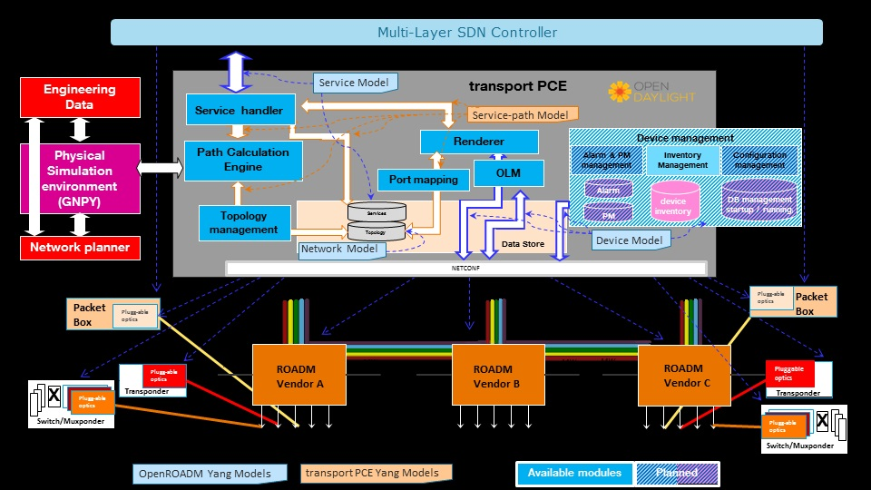

.. _transportpce-user-guide:

TransportPCE User Guide
=======================

Overview
--------

TransportPCE describes an application running on top of the OpenDaylight
controller. Its primary function is to control an optical transport
infrastructure using a non-proprietary South Bound Interface (SBI). It may be
interconnected with Controllers of different layers (L2, L3 Controller…),
a higher layer Controller and/or an Orchestrator through non-proprietary
Application Programing Interfaces (APIs). Control includes the capability to
configure the optical equipment, and to provision services according to a
request coming from a higher layer controller and/or an orchestrator.
This capability may rely on the controller only or it may be delegated to
distributed (standardized) protocols.

It provides basic alarm/fault and performance monitoring,
but this function might be externalized to improve the scalability.
A Graphical User Interface has been developped separately and is not proposed
here since automated control does not imply user interactions at the transport
controller level.

TransportPCE modular architecture is described on the next diagram. Each main
function such as Topology management, Path Calculation Engine (PCE), Service
handler, Renderer responsible for the path configuration through optical
equipment and Optical Line Management (OLM) is associated with a generic block
relying on open models, each of them communicating through published APIs.

   TransportPCE architecture

TransportPCE User-Facing Features
---------------------------------
-  **odl-transportpce**

   -  This feature contains all other features/bundles of TransportPCE project.
      If you install it, it provides all functions that the TransportPCE project
      can support.
      It exposes all Transportpce project specific models defined in "Service-path".
      These models complement OpenROADM models describing South and Northbound APIs, and define the
      data structure used to interconnect the generic blocks/functions described on the previous
      diagram.

-  **feature odl-transportpce-tapi**

   -  This feature provides transportPCE a limited support of TAPI version 2.1.2 Northbound interface.

-  **feature odl-transportpce-inventory**

   -  This feature is considered experimental. It provides transportPCE with an external connector to
      a MariaDB inventory currently limited to OpenROADM 1.2.1 devices.

How To Start
------------

Preparing for Installation
~~~~~~~~~~~~~~~~~~~~~~~~~~

1. Devices must support the standard OpenROADM Models more precisely versions 1.2.1 and 2.2.1.
   Since Magnesium SR0, an OTN experimental support is provided for OpenROADM devices 2.2.1.
   Magnesium SR2 is the first release managing end-to-end OTN services, as OCH-OTU4,
   structured ODU4 or again 10GE-ODU2e services.

2. Devices must support configuration through NETCONF protocol/API.

Installation Feature
~~~~~~~~~~~~~~~~~~~~

Run OpenDaylight and install TransportPCE Service *odl-transportpce* as below::

   feature:install odl-transportpce

if you need TAPI limited support, then run::

   feature:install odl-transportpce-tapi

When installing the TAPI feature, you might encounter a heap memory size problem in Karaf.
In that case, consider increasing Karaf heap memory size.
For example by modifying the environment variables JAVA_MIN_MEM and JAVA_MAX_MEM before starting Karaf::

   export JAVA_MIN_MEM=1024M
   export JAVA_MAX_MEM=4069M

if you need the inventory external connector support limited to 1.2.1 OpenROADM devices, then run::

   feature:install odl-transportpce-inventory

For a more detailed overview of the TransportPCE, see the :ref:`transportpce-dev-guide`.

